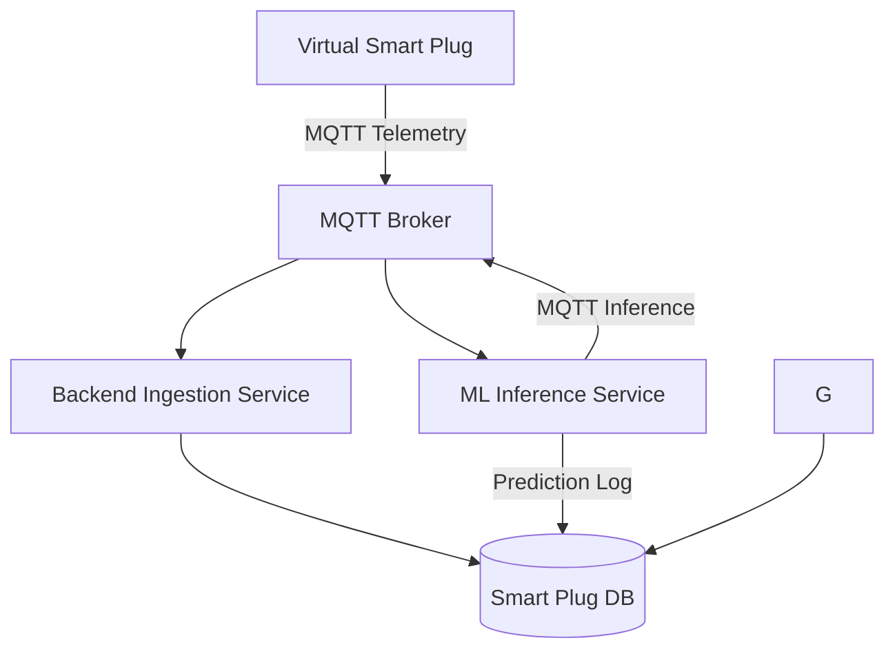

# IoT-Based Smart Plug for Appliance Recognition & Power Monitoring

## Project Overview
This project features an IoT-based Smart Plug system designed to provide granular insights into household energy consumption. By analyzing electrical signatures (voltage and current waveforms), the system identifies specific appliances in real-time and monitors their power usage.

To facilitate rapid prototyping and testing, we utilize a Software-Defined Virtual Smart Plug. This emulator mimics physical sensor output with high fidelity, ensuring the backend and ML logic remain compatible with future hardware deployments.

---

## Key Features
- High-Fidelity Simulation: A virtual smart plug that emulates raw voltage and current sensor data, providing realistic telemetry for testing.
  
- Real-Time Data Pipeline: Low-latency telemetry streaming using the MQTT protocol for responsive monitoring.
- ML-Powered Classification: Automated appliance identification using machine learning models trained on unique electrical "fingerprints."
- Behavioral Anomaly Detection: Intelligent monitoring to flag unusual power spikes or malfunctions based on device-specific historical data.
- Digital Twin Integration: A virtual 3D representation of the device to monitor system states and simulate "what-if" fault scenarios.
- Comprehensive Analytics Dashboard: A centralized web interface for real-time visualization, historical trend analysis, and cost estimation.

---

## System Architecture (High-Level)

---

## Team & Responsibilities

### Data Engineering, Analytics & ML
- **Abhirup Adhikary**
- **Ayanak Misra**

Responsibilities:
- Developing virtual sensor simulation
- Manage MQTT data streaming.
- Design ETL pipeline for ingestion.
- Implement time-series storage.
- Train appliance classification models.
- Develop anomaly detection logic.
  
### Digital Twin
- **Pratyush Kumar Chaturvedi**

Responsibilities:
- Model 3D smart plug assets.
- Integrate real-time state monitoring.
- Implement fault injection testing.

### Application Development
- **Satyam Jha**
- **Saurik Saha**

Responsibilities:
- Web-based dashboard
- Live data visualization
- Historical analytics display
- User interface & interaction

---

## Tech Stack (Proposed)
- **Language:** Python
- **Messaging:** MQTT (Mosquitto)
- **Backend:** Python services
- **Databases:** Time-series DB / SQL
- **ML:** Scikit-learn (initial), optional deep learning
- **Dashboard:** Web-based (TBD)

---

## Project Motivation
By breaking down electricity consumption by appliance, users can:
- Identify energy-intensive devices
- Detect abnormal appliance behavior
- Optimize electricity usage and reduce costs

---

## Notes
- The virtual smart plug is designed to closely mirror real hardware sensors.

- The system architecture allows seamless replacement with physical sensors in the future.
